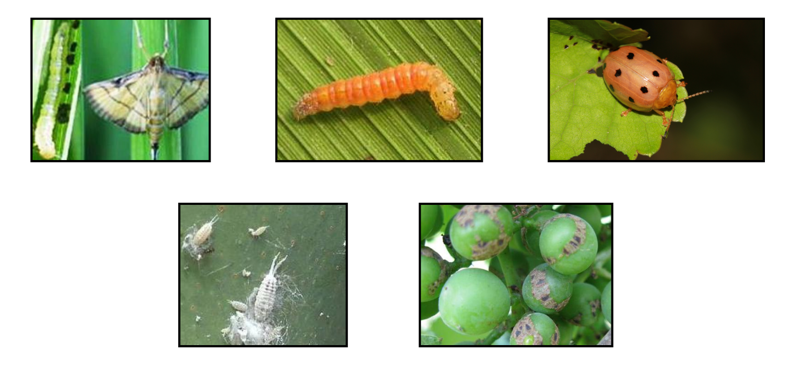
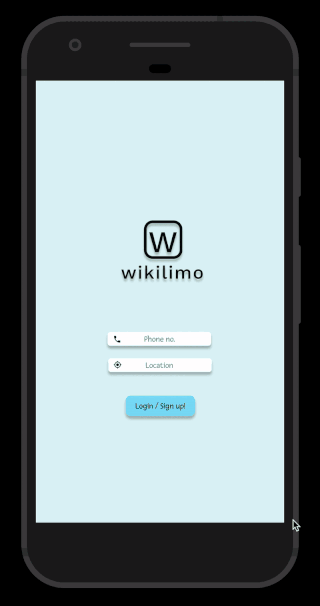

## A Lightweight Deep Learning Model for Automated Pest Detection on Mobile.

### User Guide
##### Step 1. To clone this repository, run:
```bash
git clone <this repo>
```


##### Step 2. To install dependencies run: 
```bash
pip install -r requirements.txt
```


##### Step 3. Download pest-imagery [IP102v1.1 dataset](http://xiaopingwu.cn/assets/projects/ip102/Data_Download/Data_Download.html):
###### Note: This dataset contains more than 75,000 images belonging to 102 categories, only a subset of which is showcased in this repository.



##### Step 4. To run the model locally, run:
```bash
python src/pest.py
```

This will load the data, train the model and save the mobile optimized version in `src/model/pest/`. For deploying the model to a mobile app, see [PyTorch mobile](https://pytorch.org/mobile/home/). 

## Demonstration on the [Wikilimo](www.wikilimo.co) App:
